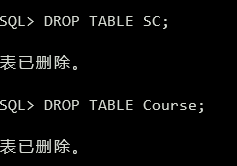

# 《数据库原理》上机报告

162150109姚远

## 实验一：SQL定义功能、数据插入

>  建立教学数据库的三个基本表，并插入数据。

任务：用 drop table 命令删除已有表SC和Course：

```sql
DROP TABLE SC;
DROP TABLE Course;
```



任务：向Student表增加“邮箱地址”列Semail，其数据类型为字符型。

```sql
ALTER TABLE Student ADD Semail VARCHAR(30);
```


此时已有数据项的SEMAIL属性为空。

任务：将Student表中出生日期Sbirthdate的数据类型由DATE型改为字符型。

在Oracle数据库中，已有数据项的列的字段类型无法修改，否则报错 `ORA-01439: 要更改数据类型, 则要修改的列必须为空`。因此需要备份原表数据，清除表数据，再修改字段数据，最后还原：

```sql
create table tmp as select * from student;
truncate table student;
alter table student modify sbirthdate varchar(20);
insert into student select * from tmp;
drop table tmp;
```


任务：给Student表按学生姓名升序建立索引。然后删除

```sql
create unique index idx_stusname on student(sname);
drop index idx_stusname;
```


任务：创建基本表并插入数据，示意图如下：


创建 `sc.sql` 文件：

```sql
DROP TABLE SC;
DROP TABLE Course;
DROP TABLE Student;
PURGE  RECYCLEBIN;

CREATE TABLE Student
(
    Sno CHAR(8) PRIMARY KEY,
    Sname VARCHAR(20) UNIQUE,
    Ssex CHAR(6),
    Sbirthdate Date,
    Smajor VARCHAR(40)
);

CREATE TABLE Course
(
    Cno CHAR(5) PRIMARY KEY,
    Cname VARCHAR(40) NOT NULL,
    Ccredit SMALLINT,
    Cpno CHAR(5),
    FOREIGN KEY (Cpno) REFERENCES Course(Cno)
);

CREATE TABLE SC
(
    Sno CHAR(8),
    Cno CHAR(5),
    Grade SMALLINT,
    Semester CHAR(5),
    Teachingclass CHAR(8),
    PRIMARY KEY(Sno, Cno),
    FOREIGN KEY(Sno) REFERENCES Student (Sno),
    FOREIGN KEY(Cno) REFERENCES Course (Cno)
);

CREATE UNIQUE INDEX Idx_CouCname ON Course(Cname);
CREATE UNIQUE INDEX Idx_SCCno ON SC(Sno ASC, CNO DESC);

INSERT INTO Student values('20180001', '李勇', '男', DATE '2000-03-08', '信息安全');
INSERT INTO Student values('20180002', '刘晨', '女', DATE '1999-09-01', '计算机科学与技术');
INSERT INTO Student values('20180003', '王敏', '女', DATE '2001-08-01', '计算机科学与技术');
INSERT INTO Student values('20180004', '张立', '男', DATE '2000-01-08', '计算机科学与技术');
INSERT INTO Student values('20180205', '陈新奇', '男', DATE '2001-11-01', '信息管理与信息系统');
INSERT INTO Student values('20180306', '赵明', '男', DATE '2000-06-12', '数据科学与大数据技术');
INSERT INTO Student values('20180307', '王佳佳', '女', DATE '2001-12-07', '数据科学与大数据技术');

INSERT INTO Course values('81001', '程序设计基础与C语言', 4, NULL);
INSERT INTO Course values('81002', '数据结构', 4, '81001');
INSERT INTO Course values('81003', '数据库原理', 4, '81002');
INSERT INTO Course values('81004', '信息系统概论', 4, '81003');
INSERT INTO Course values('81005', '操作系统', 4, '81001');
INSERT INTO Course values('81006', 'Python语言', 3, '81002');
INSERT INTO Course values('81007', '离散数学', 4, NULL);
INSERT INTO Course values('81008', '大数据技术概论', 4, '81003');

INSERT INTO SC values('20180001', '81001', 85, '20192', '81001-01');
INSERT INTO SC values('20180001', '81002', 96, '20201', '81002-01');
INSERT INTO SC values('20180001', '81003', 87, '20202', '81003-01');
INSERT INTO SC values('20180002', '81001', 80, '20192', '81001-02');
INSERT INTO SC values('20180002', '81002', 98, '20201', '81002-01');
INSERT INTO SC values('20180002', '81003', 71, '20202', '81003-02');
INSERT INTO SC values('20180003', '81001', 81, '20192', '81001-01');
INSERT INTO SC values('20180003', '81002', 76, '20201', '81002-02');
INSERT INTO SC values('20180004', '81001', 56, '20192', '81001-02');
INSERT INTO SC values('20180004', '81003', 97, '20201', '81002-02');
INSERT INTO SC values('20180205', '81003', 68, '20202', '81003-01');

COMMIT;
```

> “数据库系统概论”改为“数据库原理”

使用select语句观察效果：


## 实验二：数据查询

- 查询选修 1 号课程的学生学号与姓名。 

```sql
select sname, s.sno
from sc, student s
where sc.sno = s.sno
and sc.cno = '81001';
```


- 查询选修课程名为数据库原理的学生学号与姓名。 

```sql
select sname, s.sno
from sc, student s, course c
where s.sno = sc.sno and c.cno = sc.cno
and c.cname like '数据库原理';
```


- 查询不选 1 号课程的学生学号与姓名。

```sql
select sname, sno
from student
where sno not in(
	select s.sno
    from sc, student s
    where sc.sno = s.sno
    and sc.cno = '81001'
);
```


- 查询学习全部课程的学生姓名

```sql
select sname
from student
where not exists(
    select *
    from course
    where not exists(
        select *
        from sc
        where sc.sno = student.sno
        and sc.cno = course.cno
    )
);
```


- 查询所有学生除了选修1号课程外所有成绩均及格的学生的学号和平均成绩，其结果按平均成绩的降序排列

```sql
select sno, avg(grade)
from sc a
group by sno
having not exists(
    select * from sc b
    where a.sno = b.sno
    and b.cno != '81001'
    and b.grade <= 60
)
order by avg(grade) desc;
```


- 查询选修数据库原理成绩第2名的学生姓名

```sql
select sname
from(
    select sname, rownum as rnum
    from(
        select sname
        from student s, sc, course c
        where s.sno = sc.sno
        and sc.cno = c.cno
        and c.cname = '数据库原理'
        order by grade desc
    )
)
where rnum = 2;
```


- 查询所有3个学分课程中有3门以上（含3门）课程获80分以上（含80分）的学生的姓名

> 由于数据集内部只有1个三学分课程，故将查询的课程学分改为四

```sql
select sname
from student
where sno in(
    select s.sno
    from student s, sc, course c
    where s.sno = sc.sno
    and c.cno = sc.cno
    and c.ccredit = 4
    and sc.grade >= 80
    group by s.sno
    having count(*) >= 3
);
```


- 查询选课门数唯一的学生的学号

```sql
select sno
from sc
where sno not in(
	select a.sno
    from (
        select sno, count(*) as c
        from sc
        group by sno
    )a,(
        select sno, count(*) as c
        from sc
        group by sno
    )b
    where a.c = b.c
    and a.sno != b.sno
);
```


## 实验三：数据修改、删除

- 把1号课程的非空成绩提高10%。

```sql
update sc
set grade = grade * 1.1
where cno = '81001' and grade is not null;
```


- 在SC表中删除课程名为数据库原理的成绩的元组。

```sql
delete from sc
where cno = (
	select cno
	from course
	where cname = '数据库原理'
);
```


- 在S和SC表中删除学号为201215121的所有数据。

```sql
delete from sc where sno = '201215121';
delete from student where sno = '201215121';
```


## 实验四：视图的操作

> 这里运行sc.sql重置一下数据库。

- 建立男学生的视图，属性包括学号、姓名、选修课程名和成绩

```sql
create view man_what_can_i_say
as
select s.sno, sname, cname, grade
from student s, sc, course c
where s.sno = sc.sno
and c.cno = sc.cno
and s.ssex = '男';
```


- 在男学生视图中查询平均成绩大于80分的学生学号和姓名

```sql
select distinct sno, sname
from man_what_can_i_say
where sno in(
	select sno
	from man_what_can_i_say
	group by sno
	having avg(grade) > 80
);
```


## 实验五：库函数，授权控制

- 计算每个学生有成绩的课程门数，平均成绩

```sql
select s.sno, count(grade), avg(grade)
from student s left join sc on s.sno = sc.sno
group by s.sno
order by s.sno;
```


- 使用grant语句，把对基本表s、sc、c的使用权限传授给其它用户。

```sql
grant select, insert, update, delete on c##atri.student to c##test;
grant select, insert, update, delete on c##atri.sc to c##test;
grant select, insert, update, delete on c##atri.course to c##test;
```


- 实验完成后，撤销建立的基本表和视图。

```sql
drop table sc;
drop table student;
drop table course;
drop view man_what_can_i_say;
```


## 实验六：综合实验，实现一个小型管理信息系统